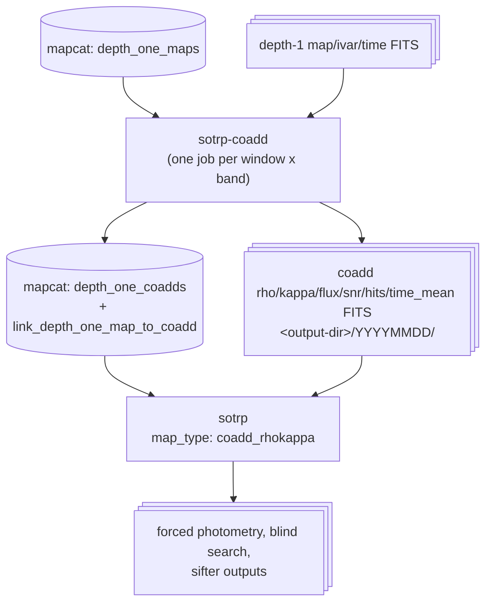

Coadding
========

sotrplib can build coadds (e.g. weekly, per-band) of depth-1 maps and then
run the time-resolved pipeline (`sotrp`) on those coadds. This happens in two
separate steps:

1. **Building coadds** with `sotrp-coadd` (`sotrplib/coadd_cli.py`), usually
   driven by `scripts/coadding/submit_week_coadds.py`, which writes one
   config and SLURM job per (time window, frequency). Finished coadds are
   written to FITS and registered in mapcat.
2. **Analyzing coadds** with `sotrp`, reading the registered coadds back out
   of mapcat (`"map_type": "coadd_rhokappa"`, see `sample_read_coadds.json`).




Environment
-----------

Both steps talk to mapcat through its environment variables:

```
export MAPCAT_DATABASE_NAME=/path/to/mapcat.sqlite
export MAPCAT_DEPTH_ONE_PARENT=/path/to/depth1/maps       # depth-1 paths are relative to this
export MAPCAT_DEPTH_ONE_COADD_PARENT=/path/to/coadds      # coadd paths are relative to this
```

Depth-1 maps and coadds have **separate** roots, so coadds can live somewhere
other than the depth-1 maps they were built from (e.g. your own data
directory while the depth-1 maps live in a shared tree). There is no fallback
from one to the other: if `MAPCAT_DEPTH_ONE_COADD_PARENT` is unset it resolves
to the current directory, and registering a coadd outside it fails up front
with an error naming the variable.

Asteroid masking during coadding uses SOCat (`socat_client_client_type=db`,
`socat_model_database_name=/path/to/socat.db`).


Building coadds: `sotrp-coadd`
------------------------------

### Why a separate tool

`sotrp` can coadd maps itself (its `map_coadder`), but it coadds first and
preprocesses afterwards. That is wrong for science coadds of raw depth-1 maps:

- moving sources (asteroids, planets) smear across many pixels once several
  days are summed, so they must be masked in each observation *before*
  merging;
- matched filtering needs each observation's own noise properties.

`sotrp-coadd` instead streams: it builds one depth-1 map, runs the
preprocessors on it, merges it into a running coadd, discards it, then loads
the next. Only one input map is in memory at a time, so memory use doesn't
grow with the number of maps in a coadd (a week of deep56 f090, 56 maps,
peaked at ~7 GB).

### Config

`sotrp-coadd -c config.json` reads a `CoaddSettings` JSON
(`sotrplib/config/coadd.py`):

| Field | Meaning |
|---|---|
| `maps` | A `mapcat_database` map generator with `map_type: "intensity"` (raw depth-1 maps; required, since this tool does its own filtering). Selects maps by `frequency`, `start_time`/`end_time`, optional `array`, and `time_binning`. |
| `preprocessors` | Applied in order to **each** depth-1 map before merging. |
| `map_coadder` | How maps are merged (`RhoKappaMapCoadder`). |
| `map_outputs` | Where/which coadd fields to write to FITS. |
| `mapcat_registration` | `coadd_name`, `coadd_type`, `enabled`. If enabled, the finished coadd is registered in mapcat. |

`submit_week_coadds.py` generates configs with these preprocessors, in order:
`planet_mask` (15 arcmin), `asteroid_mask` (SOCat, `--asteroid-mask-radius`),
`matched_filter` (1D beam profile per band if `--beam1d-template` resolves),
`kappa_rho`, and `edge_mask` (on kappa, 10 arcmin).

### Choosing which maps go into a window: `time_binning`

A depth-1 map's observation can straddle the boundary between two windows.
`time_binning` decides where it goes:

| Mode | A map is included if... | Boundary-straddling maps |
|---|---|---|
| `left-bound` | its `start_time` is in `[start, end)` | land in exactly one window |
| `right-bound` | its `stop_time` is in `[start, end)` | land in exactly one window |
| `restrictive` | it lies entirely inside the window | excluded from every window |
| `loose` | it overlaps the window at all | counted in both windows |

`submit_week_coadds.py` uses `left-bound`, so consecutive windows partition
the maps with no gaps and no double counting (for the deep56 run, the 24
weekly coadds contain all 674 depth-1 maps, each exactly once).

### How maps are merged

For rho/kappa maps, `RhoKappaMapCoadder` sums `rho` and `kappa` over the union
of the input footprints (`enmap.map_union`), so the coadd's
`flux = rho / kappa` is the inverse-variance-weighted mean flux and
`snr = rho / sqrt(kappa)`. Hits are summed. Times are merged as:

- `observation_start` / `observation_end`: earliest start / latest end of the
  input maps;
- `time_mean`: per-pixel hit-weighted mean of the inputs' **absolute** unix
  times;
- `array`: the unique input arrays, sorted and concatenated (e.g. `i1i3i4i6`).

Maps from all arrays of a band are combined into one coadd unless `--array`
restricts it (mapcat's `depth_one_coadds` has no array column, so a
registered coadd is frequency-only).

### Outputs

Fields are written in two passes (`rho`, `kappa` before `finalize()`, then
`flux`, `snr` after), so any of `rho kappa flux snr hits time_mean` can be
requested. Files are named `{frequency}_{array}_{start}_{field}.fits`, where
`{start}` is the unix time of the **earliest input map's start** (not the
window start or the mean time), e.g.
`f090_i1i3i4i6_1758171214_flux.fits`.

`submit_week_coadds.py` puts each window in a subdirectory named for the
window's UTC start date:

```
<output-dir>/
  20250904/  f090_i1i3i4i6_1756951951_{rho,kappa,flux,snr,hits,time_mean}.fits  (+ f150, f220, f280)
  20250911/
  ...
  configs/   week00_f090.json ...
  slurm/     week00_f090.slurm, week00_f090.log ...
```

Windows are rolling `--window-days` windows anchored at the first
observation, not calendar weeks.

### Registration in mapcat

With `mapcat_registration.enabled`, `register_coadd()` writes:

- `depth_one_coadds`: one row per coadd, with `coadd_name`, `coadd_type`,
  `frequency`, `start_time`/`stop_time`/`ctime`, and paths relative to
  `MAPCAT_DEPTH_ONE_COADD_PARENT`: `map_path` (flux), `rho_path`,
  `kappa_path` (also `ivar_path`), `mean_time_path`;
- `link_depth_one_map_to_coadd`: one `(map_id, coadd_id)` row per input map;
- `time_domain_processing`: a `completed` status row for the coadd, and a
  `completed`/`failed` status for each input depth-1 map.

Before any coadding starts, `sotrp-coadd` checks that every output directory
is under `MAPCAT_DEPTH_ONE_COADD_PARENT`, so a misconfigured run fails in
seconds rather than after hours of coadding.

### Status handling

The reader marks each depth-1 map `processing` as soon as it's read. On
success every merged map is marked `completed`; on any exception every map
the run read is marked `failed` (none of them made it into a registered
coadd) and the error is re-raised. Maps already `completed` are skipped
unless `rerun` is set, and maps manually marked `permafail` are always
skipped.

### Running weekly coadds on SLURM

```
python scripts/coadding/submit_week_coadds.py \
  --database-name /path/to/mapcat.sqlite \
  --depth-one-parent /path/to/depth1/<run> \
  --output-dir /path/to/weekly_coadds \
  --repo-dir /path/to/your/sotrplib/checkout \
  --socat-db-path /path/to/socat.db \
  --ephem-file-path '' \
  --time 08:00:00
```

This writes one config + SLURM script per (window, band) and does nothing
else; add `--submit` to `sbatch` them. Useful flags:

- `--window-days` (default 7), `--start-time`/`--end-time` (default: the
  database's full time range), `--frequencies`;
- `--coadd-parent` (default `--output-dir`): exported as
  `MAPCAT_DEPTH_ONE_COADD_PARENT`;
- `--repo-dir`: the checkout each job `cd`s into and activates `.venv` in --
  point this at a persistent checkout;
- `--ephem-file-path ''`: disables the JPL-ephemeris fallback so asteroid
  masking uses SOCat only and fails loudly if SOCat isn't configured;
- `--rerun`: needed if the depth-1 maps are already `completed` (e.g. from a
  previous `sotrp` run on them) -- otherwise every map is skipped and the job
  finishes "successfully" with no coadd;
- `--no-register-coadds`: write FITS only.

Runtime is roughly 5-6 minutes per input map, so a busy week (~50 maps at
f090/f150) takes ~5 hours: set `--time` accordingly (the 4 h default is too
short for those). Memory stays around 7 GB per job.


Analyzing coadds with `sotrp`
-----------------------------

### Config

Read registered coadds with the `mapcat_database` generator and
`map_type: "coadd_rhokappa"` (see `sample_read_coadds.json`):

```json
"maps": {
    "map_generator_type": "mapcat_database",
    "map_type": "coadd_rhokappa",
    "instrument": "SOLAT",
    "frequency": "f090",
    "start_time": "2025-08-01T00:00:00",
    "end_time": "2026-01-01T00:59:59",
    "rerun": "True"
},
"preprocessors": [],
```

- Coadds are selected by `frequency`, `start_time`/`end_time` (compared with
  each coadd's own start/stop times), optionally `coadd_type`, and
  `map_ids` (which are `coadd_id`s here). `array` and source-position
  filters are rejected, because coadds have no tube_slot or sky-coverage
  rows in mapcat.
- `time_binning` can be left at its default: each coadd is already a whole
  window.
- **No preprocessors.** Planet/asteroid masking, matched filtering,
  kappa/rho and edge masking were all applied to every input map during
  coadding. Postprocessors (e.g. `flatfield`) still apply.
- `map_units` defaults to Jy.

### What the reader does

`CoaddRhoKappaMapReader` (`sotrplib/maps/database.py`) queries
`depth_one_coadds` and yields a `CoaddRhoAndKappaMap` per coadd:

- `rho`, `kappa` and `time_mean` paths are resolved against
  `MAPCAT_DEPTH_ONE_COADD_PARENT`;
- `map_type` is `"coadd"`, so processing status is tracked under the
  `coadd_id` (not a depth-1 `map_id`);
- `array` is rebuilt from the linked depth-1 maps' `tube_slot`s, giving the
  same label as the coadd's file names (e.g. `i1i3i4i6`); the beam FWHM used
  downstream depends only on frequency;
- the time map is used as-is: a coadd's `time_mean` already holds absolute
  unix times, whereas depth-1 time maps are seconds since the observation
  start and get the start time added.

### What the pipeline does with a coadd

The same stages as for a depth-1 map: build, `finalize()` (flux/SNR from
rho/kappa), postprocessors, pointing sources, forced photometry, source
subtraction, blind search, sifter, and outputs. Differences:

- **Pointing:** a pointing model is still fitted on the coadd and used for
  that run, but it is **not saved** to mapcat -- the pointing-residual table
  is keyed by depth-1 `map_id` (and SQLite doesn't enforce the foreign key,
  so it would otherwise be written as an orphan row). Depth-1 pointing
  models are never loaded for a coadd. Note the input maps were coadded
  without per-map pointing corrections.
- **Times:** each measurement's time comes from the coadd's per-pixel
  hit-weighted mean time, spanning up to the full window.

### `rerun` and processing status

`time_domain_processing` holds one status per map or coadd, and it's shared
between "was this built/merged" and "has sotrp processed this":

- `sotrp-coadd` marks each coadd `completed` when it registers it, so a
  `sotrp` run over coadds needs `rerun: true` or every coadd is skipped;
- likewise `sotrp-coadd` marks its input depth-1 maps `completed`, which
  overwrites whatever status a previous `sotrp` run on those maps left.

### Running on SLURM

One job per band is a natural split (each processes that band's coadds in
sequence). A job script is the same as for depth-1 maps:

```
cd /path/to/sotrplib
source .venv/bin/activate
source env_setup   # MAPCAT_* (incl. MAPCAT_DEPTH_ONE_COADD_PARENT), socat, lightcurvedb
srun --overlap sotrp -c /path/to/f090_config.json > f090_sotrp.log 2>&1
```


Datetimes and sqlmodel versions
-------------------------------

sqlmodel >= 0.0.43 stores datetime fields as UTC-aware and rejects naive
datetimes. sotrplib passes UTC-aware datetimes to mapcat everywhere and
compares stored times via astropy `Time` (which treats a naive value as UTC),
so it works with both older and newer sqlmodel. SQLite files written by
either are interchangeable.
