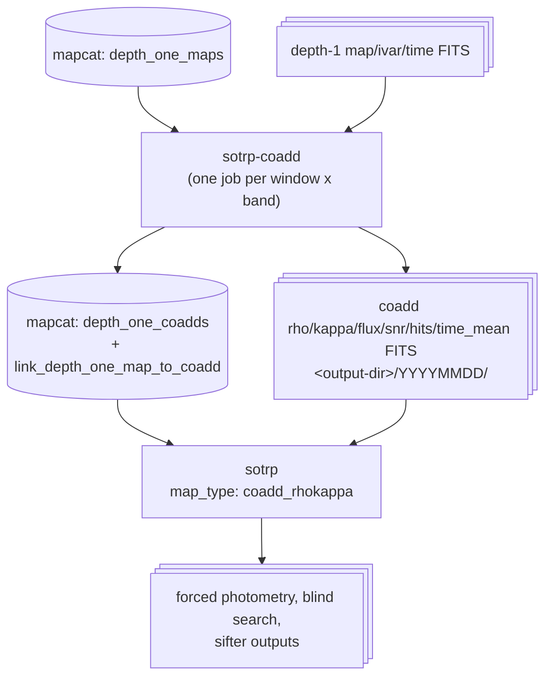

Coadds
======

This page tells how to make coadds of depth-1 maps (for example, one coadd
for each week and each band) and how to analyze them. There are two steps.
Each step uses a command that the package installs (see
[Overview](overview.md)):

1. **Make the coadds** with the `sotrp-coadd` command
   (`sotrplib/coadd_cli.py`). The command writes each coadd to FITS files and
   registers it in mapcat. For many windows, use the
   `scripts/coadding/submit_week_coadds.py` script. The script writes one
   `sotrp-coadd` config and one SLURM job for each time window and each
   frequency.
2. **Analyze the coadds** with the `sotrp` command. `sotrp` reads the
   registered coadds from mapcat (`"map_type": "coadd_rhokappa"`, see
   `sample_read_coadds.json`).

The two commands use functions and classes in the `sotrplib` library. You can
also use them directly in Python. See "Library functions for coadds" below.


```mermaid
flowchart TD

d1db[(mapcat: depth_one_maps)]
d1fits@{ shape: procs, label: "depth-1 map/ivar/time FITS"}
coadd_cli["sotrp-coadd<br/>(one job per window x band)"]
cfits@{ shape: procs, label: "coadd rho/kappa/flux/snr/hits/time_mean FITS<br/>&lt;output-dir&gt;/YYYYMMDD/"}
cdb[(mapcat: depth_one_coadds<br/>+ link_depth_one_map_to_coadd)]
trp["sotrp<br/>map_type: coadd_rhokappa"]
out@{ shape: procs, label: "forced photometry, blind search,<br/>sifter outputs"}

d1db --> coadd_cli
d1fits --> coadd_cli
coadd_cli --> cfits
coadd_cli --> cdb
cdb --> trp
cfits --> trp
trp --> out
```


Environment
-----------

The two steps use these mapcat environment variables:

```
export MAPCAT_DATABASE_NAME=/path/to/mapcat.sqlite
export MAPCAT_DEPTH_ONE_PARENT=/path/to/depth1/maps       # depth-1 paths are relative to this
export MAPCAT_DEPTH_ONE_COADD_PARENT=/path/to/coadds      # coadd paths are relative to this
```

Depth-1 maps and coadds have **different** root directories. Thus, you can
keep the coadds in a different directory from the depth-1 maps. For example,
the coadds can be in your own data directory, and the depth-1 maps can be in
a shared directory.

The two variables are independent:

- If `MAPCAT_DEPTH_ONE_COADD_PARENT` is not set, its value is the current
  directory. `sotrp-coadd` does not use `MAPCAT_DEPTH_ONE_PARENT` in its
  place.
- If a coadd is not in `MAPCAT_DEPTH_ONE_COADD_PARENT`, the registration
  fails before coadd work starts. The error message gives the name of the
  variable.

The asteroid mask uses SOCat. Set `socat_client_client_type=db` and
`socat_model_database_name=/path/to/socat.db`.


Make coadds: `sotrp-coadd`
--------------------------

### Why there is a separate command

The `sotrp` command can make a coadd with its `map_coadder`. But `sotrp` makes the coadd
first and applies the preprocessors after. This order is not correct for a
science coadd of raw depth-1 maps, for two reasons:

- A source that moves (an asteroid or a planet) crosses many pixels in a
  sum of several days. Thus, you must mask it in each observation before the
  merge.
- The matched filter must use the noise properties of each observation.

`sotrp-coadd` does these steps for one depth-1 map at a time:

1. It builds the map.
2. It applies the preprocessors to the map.
3. It merges the map into the coadd.
4. It removes the map from memory.

Thus, there is only one input map in memory at a time. Memory use does not
increase with the number of maps in the coadd. For example, one week of
deep56 f090 data (56 maps) used a maximum of approximately 7 GB.

### Config

`sotrp-coadd -c config.json` reads a `CoaddSettings` JSON file
(`sotrplib/config/coadd.py`):

| Field | Meaning |
|---|---|
| `maps` | A `mapcat_database` map generator with `map_type: "intensity"` (raw depth-1 maps). This field is necessary, because this tool applies its own filter. The generator selects maps by `frequency`, `start_time`/`end_time`, `array` (optional) and `time_binning`. |
| `preprocessors` | The preprocessors to apply, in sequence, to **each** depth-1 map before the merge. |
| `map_coadder` | The method that merges the maps (`RhoKappaMapCoadder`). |
| `map_outputs` | The coadd fields to write to FITS, and the location of the files. |
| `mapcat_registration` | `coadd_name`, `coadd_type` and `enabled`. If `enabled` is true, `sotrp-coadd` registers the coadd in mapcat. |

The configs from `submit_week_coadds.py` apply these preprocessors, in this
sequence:

1. `planet_mask` (15 arcmin).
2. `asteroid_mask` (SOCat, `--asteroid-mask-radius`).
3. `matched_filter` (the 1D beam profile of the band, if
   `--beam1d-template` finds a file).
4. `kappa_rho`.
5. `edge_mask` (on kappa, 10 arcmin).

### Select the maps for a window: `time_binning`

The observation of a depth-1 map can start in one window and stop in the
next window. The `time_binning` field sets the window that gets this map:

| Mode | The window includes a map if... | A map that crosses a window boundary... |
|---|---|---|
| `left-bound` | its `start_time` is in `[start, end)` | goes into one window only |
| `right-bound` | its `stop_time` is in `[start, end)` | goes into one window only |
| `restrictive` | all of the map is in the window | goes into no window |
| `loose` | a part of the map is in the window | goes into the two windows |

`submit_week_coadds.py` uses `left-bound`. Thus, the windows include each map
one time only, and there are no gaps. For example, the 24 weekly coadds of
the deep56 run contain all 674 depth-1 maps, and each map is in one coadd
only.

### How the tool merges the maps

For rho/kappa maps, `RhoKappaMapCoadder` adds `rho` and `kappa` over the
union of the input footprints (`enmap.map_union`). Thus, in the coadd:

- `flux = rho / kappa` is the mean flux, with inverse-variance weights.
- `snr = rho / sqrt(kappa)`.
- `hits` is the sum of the input hits.

The tool merges the times and the arrays as follows:

- `observation_start` is the earliest start of the input maps.
  `observation_end` is the latest end.
- `time_mean` is the mean, with hit weights, of the **absolute** unix times
  of the inputs. The tool calculates it for each pixel.
- `array` is the list of the different input arrays, in sequence and
  without spaces (for example, `i1i3i4i6`).

A coadd contains the maps from all arrays of a band. Use `--array` to select
fewer arrays. The `depth_one_coadds` table in mapcat has no array column.
Thus, a registered coadd has a frequency but no array.

### Outputs

The tool writes the fields in two passes:

1. It writes `rho` and `kappa` before `finalize()`.
2. It writes `flux` and `snr` after `finalize()`.

Thus, you can request each of these fields: `rho`, `kappa`, `flux`, `snr`,
`hits` and `time_mean`.

The file names have the format `{frequency}_{array}_{start}_{field}.fits`,
for example `f090_i1i3i4i6_1758171214_flux.fits`. `{start}` is the unix time
of the **start of the earliest input map**. It is not the start of the window
or the mean time.

Each file with flux units records its unit in the FITS `BUNIT` header. The
matched filter uses mJy. Thus:

- `flux` has the unit `mJy`.
- `rho` has the unit `mJy-1`.
- `kappa` has the unit `mJy-2`.
- `snr`, `hits` and `time_mean` have no flux unit.

When sotrplib reads a map from disk, it gets the flux unit from `BUNIT`. If
the file has no `BUNIT`, sotrplib uses the `map_units` value from the config.

`submit_week_coadds.py` puts each window in a subdirectory. The name of the
subdirectory is the UTC start date of the window:

```
<output-dir>/
  20250904/  f090_i1i3i4i6_1756951951_{rho,kappa,flux,snr,hits,time_mean}.fits  (+ f150, f220, f280)
  20250911/
  ...
  configs/   week00_f090.json ...
  slurm/     week00_f090.slurm, week00_f090.log ...
```

Each window has a length of `--window-days` days. The first window starts at
the first observation. The windows are not calendar weeks.

### Registration in mapcat

If `mapcat_registration.enabled` is true, `register_coadd()` writes these
rows:

- `depth_one_coadds`: one row for each coadd. The row contains `coadd_name`,
  `coadd_type`, `frequency`, `start_time`, `stop_time`, `ctime` and the file
  paths. The paths are relative to `MAPCAT_DEPTH_ONE_COADD_PARENT`:
  `map_path` (flux), `rho_path`, `kappa_path` (also `ivar_path`) and
  `mean_time_path`.
- `link_depth_one_map_to_coadd`: one `(map_id, coadd_id)` row for each input
  map.
- `time_domain_processing`: a `completed` status row for the coadd.

`sotrp-coadd` writes a status row for each input depth-1 map only if
`track_processing` is true. See "Status of the input maps" below.

Before coadd work starts, `sotrp-coadd` makes sure that each output directory
is in `MAPCAT_DEPTH_ONE_COADD_PARENT`. Thus, an incorrect configuration
fails in seconds, not after many hours of work.

### Status of the input maps

By default, `sotrp-coadd` does not change the `time_domain_processing` status
of the input depth-1 maps. There are two reasons:

- This status records the result of the `sotrp` run on the map.
- One map can be in many coadds (weekly, monthly). One status for each map
  cannot show this.

Thus, `sotrp-coadd` also uses the maps that have the status `completed`, and
it writes no status for them. It always skips a map that has the status
`permafail`.

The links from a coadd to its depth-1 maps (`register_coadd()`) record the
maps that are in the coadd.

If a map causes an error in the build, the preprocessors or the merge:

1. `sotrp-coadd` records the error and the traceback in the log
   (`stream_coadd.map_failed`).
2. It does not put the map in the coadd.
3. It continues with the next map.

At the end of the run, the `sotrp_coadd.maps_excluded` warning gives the
`map_id`s of these maps. To find the maps to process again, compare the maps
in the window with the linked maps of the coadd. If all maps fail, the run
stops with an error, and there is no coadd.

To record a status for each input map, set `"track_processing": true` in the
`maps` config. Then `sotrp-coadd` does these steps:

- It sets the status of each map that it reads to `processing`.
- It skips the maps that have the status `completed`, if `rerun` is not set.
- It sets the status of each merged map to `completed`.
- It sets the status of each map that it did not merge to `failed`.
- If the run stops because of an error, it sets the status of each map that
  it read to `failed`.

### Run weekly coadds on SLURM

```
python scripts/coadding/submit_week_coadds.py \
  --database-name /path/to/mapcat.sqlite \
  --depth-one-parent /path/to/depth1/<run> \
  --output-dir /path/to/weekly_coadds \
  --repo-dir /path/to/your/sotrplib/checkout \
  --socat-db-path /path/to/socat.db \
  --ephem-file-path '' \
  --time 08:00:00
```

This command writes one config and one SLURM script for each window and each
band. It does not submit the jobs. Add `--submit` to submit them with
`sbatch`. These options are also useful:

- `--window-days` (default 7), `--start-time` and `--end-time` (default: all
  of the time range in the database), and `--frequencies`.
- `--coadd-parent` (default: `--output-dir`). The script exports this value
  as `MAPCAT_DEPTH_ONE_COADD_PARENT`.
- `--repo-dir`: each job goes to this checkout and activates its `.venv`.
  Use a checkout that you do not delete.
- `--ephem-file-path ''`: the asteroid mask does not use the JPL ephemeris.
  It uses SOCat only. If SOCat is not configured, the job fails with an
  error.
- `--rerun`: this option has an effect only if `track_processing` is true.
  By default, `sotrp-coadd` does not skip `completed` depth-1 maps.
- `--no-register-coadds`: write the FITS files, but do not register the
  coadds in mapcat.

Set `--time` for the number of maps in a window. Each input map takes
approximately 5 to 6 minutes. A busy week (approximately 50 maps at f090 or
f150) takes approximately 5 hours. The default time limit of 4 hours is too
short for these weeks. Each job uses approximately 7 GB of memory.


Analyze coadds with `sotrp`
---------------------------

### Config

To read registered coadds, use the `mapcat_database` generator with
`map_type: "coadd_rhokappa"` (see `sample_read_coadds.json`):

```json
"maps": {
    "map_generator_type": "mapcat_database",
    "map_type": "coadd_rhokappa",
    "instrument": "SOLAT",
    "frequency": "f090",
    "start_time": "2025-08-01T00:00:00",
    "end_time": "2026-01-01T00:59:59",
    "rerun": "True"
},
"preprocessors": [],
```

- The generator selects coadds by `frequency` and `start_time`/`end_time`.
  It compares these times with the start and stop times of each coadd.
- You can also select coadds by `coadd_type` and `map_ids`. For coadds, the
  `map_ids` are `coadd_id`s.
- The generator does not accept `array` or source-position filters. Mapcat
  has no tube_slot rows or sky-coverage rows for coadds.
- You can use the default `time_binning`, because each coadd is one full
  window.
- **Do not add preprocessors.** `sotrp-coadd` applied the planet mask, the
  asteroid mask, the matched filter, kappa/rho and the edge mask to each
  input map. You can use postprocessors (for example, `flatfield`).
- The default of `map_units` is Jy.

### What the reader does

`CoaddRhoKappaMapReader` (`sotrplib/maps/database.py`) reads the
`depth_one_coadds` table. It gives one `CoaddRhoAndKappaMap` for each coadd:

- It finds the `rho`, `kappa` and `time_mean` files in
  `MAPCAT_DEPTH_ONE_COADD_PARENT`.
- `map_type` is `"coadd"`. Thus, sotrplib records the processing status for
  the `coadd_id`, not for a depth-1 `map_id`.
- It makes `array` from the `tube_slot`s of the linked depth-1 maps. This
  label is the same as the label in the file names of the coadd (for
  example, `i1i3i4i6`). The beam FWHM that the pipeline uses depends only on
  the frequency.
- It uses the time map without change. The `time_mean` map of a coadd
  contains absolute unix times. The time map of a depth-1 map contains
  seconds from the start of the observation. Thus, the reader adds the start
  time to a depth-1 time map only.

### What the pipeline does with a coadd

The pipeline does the same steps as for a depth-1 map:

1. Build.
2. `finalize()` (flux and SNR from rho and kappa).
3. Postprocessors.
4. Pointing sources.
5. Forced photometry.
6. Source subtraction.
7. Blind search.
8. Sifter.
9. Outputs.

There are two differences:

- **Pointing:** the pipeline fits a pointing model on the coadd and uses it
  for that run. It does **not save** the model to mapcat. The key of the
  pointing-residual table is the depth-1 `map_id`. SQLite does not enforce
  the foreign key, so the table would get a row with no related map.
  The pipeline does not load depth-1 pointing models for a coadd.
- **Times:** the time of each measurement is the mean time, with hit weights,
  of the pixel in the coadd. This time can be anywhere in the window.

Note that `sotrp-coadd` did not apply a pointing correction to the input maps
before the merge.

### `rerun` and processing status

`time_domain_processing` has one status for each map or coadd:

- `sotrp-coadd` sets the status of each coadd to `completed` when it registers
  the coadd. Thus, a `sotrp` run on coadds must set `rerun: true`. If not,
  `sotrp` skips all coadds.
- By default, `sotrp-coadd` does not change the status of its input depth-1
  maps (see "Status of the input maps"). Thus, it does not overwrite the
  status that `sotrp` recorded.

### Run on SLURM

Use one job for each band. Each job analyzes the coadds of its band, one
after the other. The job script is the same as for depth-1 maps:

```
cd /path/to/sotrplib
source .venv/bin/activate
source env_setup   # MAPCAT_* (incl. MAPCAT_DEPTH_ONE_COADD_PARENT), socat, lightcurvedb
srun --overlap sotrp -c /path/to/f090_config.json > f090_sotrp.log 2>&1
```


Library functions for coadds
----------------------------

The commands use these parts of the library. Use them directly to make
coadds in your own code:

| Function or class | Module | What it does |
|---|---|---|
| `stream_coadd()` | `sotrplib.maps.map_coadding` | Builds, preprocesses and merges maps one at a time. |
| `RhoKappaMapCoadder` | `sotrplib.maps.map_coadding` | Merges rho/kappa maps. |
| `MapCatDatabaseReader` subclasses | `sotrplib.maps.database` | Select depth-1 maps from mapcat (`time_binning`, `track_processing`). |
| `register_coadd()` | `sotrplib.maps.database` | Registers a coadd and its map links in mapcat. |
| `CoaddRhoKappaMapReader` | `sotrplib.maps.database` | Reads registered coadds from mapcat. |
| `CoaddRhoAndKappaMap` | `sotrplib.maps.core` | A registered coadd, read from disk. |
| `MapOutputSerializer` | `sotrplib.outputs.core` | Writes map fields to FITS, with `BUNIT`. |

`scripts/coadding/coadd_maps.py` is an example that uses the library
directly, without a command.


Datetimes and sqlmodel versions
-------------------------------

sqlmodel 0.0.43 and later versions store datetime fields as UTC-aware values.
These versions do not accept naive datetimes. sotrplib is compatible with the
older and the newer versions:

- It gives UTC-aware datetimes to mapcat.
- It compares stored times with astropy `Time`. `Time` uses UTC for a naive
  value.

The two versions write SQLite files that you can use with each version.
