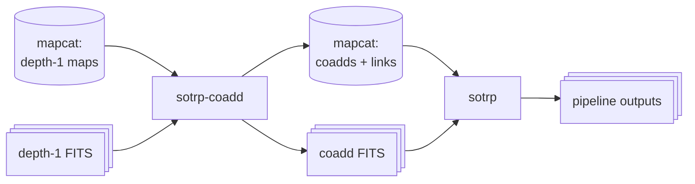

Coadds: overview
================

A coadd is the sum of many depth-1 maps, for example all maps of one band in
one week. A coadd has less noise than one depth-1 map. Thus, the pipeline can
find fainter sources on longer time scales.

There are two stages:

1. **Make the coadds.** The `sotrp-coadd` command reads depth-1 maps from
   mapcat and makes one coadd. It writes the coadd to FITS files and
   registers it in mapcat.
2. **Analyze the coadds.** The `sotrp` command reads the registered coadds
   from mapcat. It runs the time-resolved pipeline on each coadd, as it does
   on a depth-1 map.

Mapcat connects the two stages. The second stage uses the coadds that the
first stage registered.

Stage 1: make the coadds
------------------------

`sotrp-coadd` does these steps for each depth-1 map in the time window, one
map at a time:

1. It reads the map from disk.
2. It applies the preprocessors: masks, the matched filter and cleaning.
3. It merges the map into the coadd.
4. It removes the map from memory.

There are two reasons for this sequence:

- The preprocessors must see each observation separately. A source that
  moves (an asteroid or a planet) crosses many pixels in a sum of several
  days. The matched filter must use the noise properties of each
  observation.
- Only one input map is in memory at a time. Thus, memory use does not
  increase with the number of maps.

The `sotrp` command also has a `map_coadder`, but it makes the coadd first
and applies the preprocessors after. Thus, use `sotrp-coadd` for coadds of
raw depth-1 maps.

When the coadd is complete, `sotrp-coadd` writes the coadd to FITS files. It
then registers the coadd in mapcat, with a link to each depth-1 map in the
coadd.

Stage 2: analyze the coadds
---------------------------

`sotrp` reads the registered coadds from mapcat. The coadds already have the
preprocessors applied. Thus, `sotrp` starts with the postprocessors. Then it
does the same steps as for a depth-1 map: forced photometry, source
subtraction, blind search, the sifter and the outputs.

The library
-----------

The two commands use functions and classes in the `sotrplib` library. You can
also use them directly in Python:

| Function or class | Module | What it does |
|---|---|---|
| `stream_coadd()` | `sotrplib.maps.map_coadding` | Builds, preprocesses and merges maps one at a time. |
| `RhoKappaMapCoadder` | `sotrplib.maps.map_coadding` | Merges rho/kappa maps. |
| `IntensityMapReader` | `sotrplib.maps.database` | Selects depth-1 maps from mapcat. |
| `register_coadd()` | `sotrplib.maps.database` | Registers a coadd and its map links in mapcat. |
| `CoaddRhoKappaMapReader` | `sotrplib.maps.database` | Reads registered coadds from mapcat. |
| `CoaddRhoAndKappaMap` | `sotrplib.maps.core` | A registered coadd, read from disk. |
| `MapOutputSerializer` | `sotrplib.outputs.core` | Writes map fields to FITS files. |

More information
----------------

- [Make coadds with `sotrp-coadd`](make_coadds.md): the configuration, map
  selection, preprocessors, outputs and registration.
- [Analyze coadds with `sotrp`](analyze_coadds.md): the configuration, the
  dependencies and the processing status.
- [Helper scripts](scripts.md): scripts that write configs and SLURM jobs for
  many time windows.
