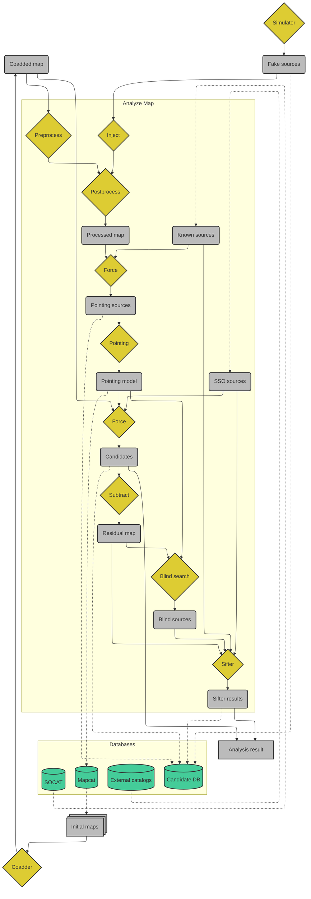
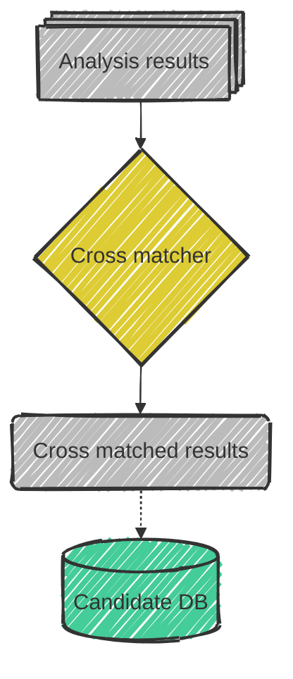

# Pipeline Flowchart

The workflow for the time-resolved pipeline.
Inputs are read from a range of databases and written to the same(???) databases (green).
Gray boxes are objects that are stored in memory.

Currently, the cross-matching follows directly in memory from the individually analyzed maps,
requires no additional inputs, and updates the records for the new candidates.

