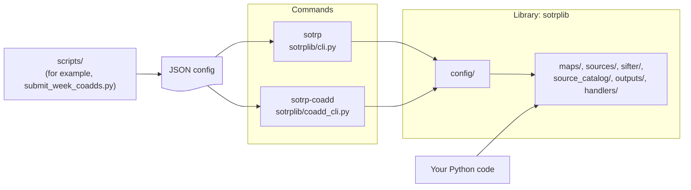

Overview
========

The SO Time-Resolved Pipeline has three parts:

1. **The library** (`sotrplib`). A Python package with the classes and
   functions for each step of the analysis: maps, preprocessors, forced
   photometry, blind search, the sifter and the outputs.
2. **The commands** (`sotrp` and `sotrp-coadd`). Programs that `pyproject.toml`
   installs with the package. Each command reads a JSON config, makes the
   library objects from it and runs a pipeline.
3. **The scripts** (`scripts/`). Examples and helpers that are not installed.
   Some scripts write configs and SLURM jobs for the commands. Other scripts
   use the library directly.

Use a command to run a standard pipeline from a config file. Use the library
directly to make a different pipeline, or to use one step in your own code.




The library
-----------

Install the package to get the library (see [Installation](installing.md)).
Then import the modules in Python:

| Module | Contents |
|---|---|
| `sotrplib.maps` | Map classes (`ProcessableMap` and its subclasses), map readers for mapcat, preprocessors, postprocessors, masks, coadders and pointing models. |
| `sotrplib.sources` | Forced photometry, blind search, source subtraction and source classes. |
| `sotrplib.sifter` | The sifter, which compares the detected sources with the catalogs, and the map matcher, which groups the transient candidates across maps (see [Map matching](map_matching.md)). |
| `sotrplib.source_catalog` | Source catalogs, for example SOCat. |
| `sotrplib.outputs` | Outputs for sources (JSON, pickle, cutouts, lightcurvedb, lightserve) and for maps (FITS). |
| `sotrplib.handlers` | The pipeline runners: `PipelineRunner` (`basic.py`) and `PrefectRunner` (`prefect.py`). |
| `sotrplib.config` | Pydantic models that make library objects from a JSON config. The commands use these models. |
| `sotrplib.sims` | Simulated maps and sources. |
| `sotrplib.solar_system` | Solar-system ephemerides. |
| `sotrplib.filters`, `sotrplib.observatories`, `sotrplib.utils` | Filters, observatory data and utilities. |

[Running on ACT Data](act.md) shows a full pipeline that uses the library
directly, without a command.


The commands
------------

`pyproject.toml` (`[project.scripts]`) installs these commands:

| Command | Code | Config | What it does |
|---|---|---|---|
| `sotrp` | `sotrplib/cli.py` | `Settings` (`sotrplib/config/config.py`) | Runs the time-resolved pipeline on maps. See [Configuring the Pipeline](configuration.md). |
| `sotrp-coadd` | `sotrplib/coadd_cli.py` | `CoaddSettings` (`sotrplib/config/coadd.py`) | Makes coadds of depth-1 maps and registers them in mapcat. See [Coadds](coadding/overview.md). |

Each command has the same form:

```
sotrp -c config.json
sotrp-coadd -c config.json
```

The command gives the config to its Pydantic model. The model makes the
library objects. Then the command runs them. A command contains little
analysis code. The analysis code is in the library.

The `runner` field of the `sotrp` config selects the runner: `basic`
(`PipelineRunner`) or `prefect` (`PrefectRunner`). See
[Run `sotrp` with the prefect runner](prefect.md).


The scripts
-----------

The `scripts/` directory is not part of the installed package. To use a
script, run it from a checkout of the repository.

| Directory | Contents |
|---|---|
| `scripts/coadding/` | `submit_week_coadds.py` writes `sotrp-coadd` configs and SLURM jobs for weekly coadds. `coadd_maps.py` is an example that uses the library directly. |
| `scripts/depth1_map_analysis/` | Scripts that write `sotrp` configs and SLURM jobs for depth-1 maps. |
| `scripts/historical_lightcurve_extractor/` | Scripts that extract lightcurves from ACT depth-1 maps. |
| `scripts/end_to_end/` | An end-to-end test with SOCat, lightcurvedb and lightserve. |

The scripts are examples and tools for specific runs. The library and the
commands have tests. The scripts do not have tests.
